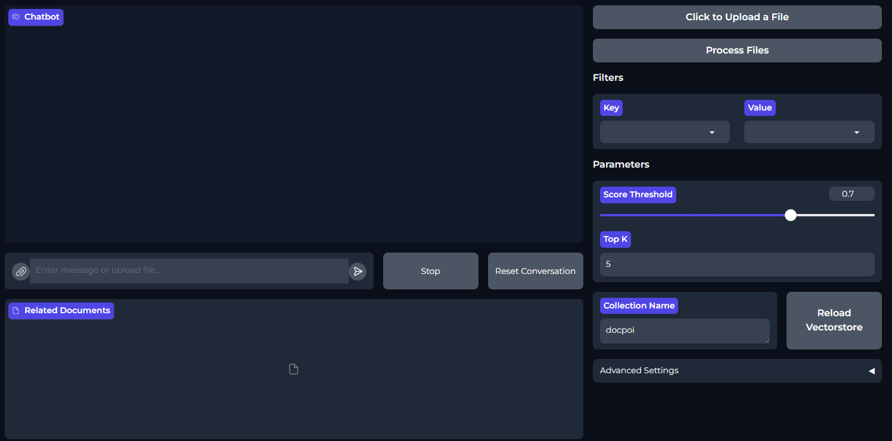

# DocPOI

## !! Speech Function is disabled for a short time pls wait for next implimentation

**Contact**  
Please contact me or our group for any issues, feature recommendations, ideas, or even criticism of the code. Everything is welcome!  
You can join our Discord for the best experience.  
Website: [eren.enpoi.com](https://eren.enpoi.com)  
Discord: [Join our Discord](https://discord.gg/D5M6WpWB)  
Email: eren@enpoi.com  
Feel free to contribute and just hang out ;)

## Requirements
- **Over 35GB of free storage space**
- **A NVIDIA GPU with over 6GB of VRAM** (While theoretically it would work with CPU offloading but the performance would be significantly worse.)

## The Problem

I have always struggled with managing my hundreds of thousands of documents, never being able to find the information I needed without sifting through the chaos I call my paper piles of official documents, certificates, and more. As someone who tends to procrastinate, this is not sustainable. To solve this problem, I wanted to create an assistant that not only acts as a personal assistant but also retrieves documents based on my query, eliminating the need for manual searches.

Overall, this project aims to solve the following common problems:

- **Scanning documents but never OCRing them:** It's a pain to OCR documents one by one, batch by batch, or manually enter the information when needed.
- **Not naming documents properly:** I often tell myself I’ll do it later or remember where I saved them, but I never do.
- **Security concerns:** Using drives, clouds, or other AI agents like ChatGPT for personal files can be risky.
- **Lack of a quick personal assistant:** There's a need for a personal assistant that is always available to help, securely and locally.

---



---

DocPOI is a personal assistant that runs locally on your computer, utilizing your GPU to access and manage your personal documents securely. The focus is on maintaining absolute security by ensuring that everything runs locally, with the option to host it locally for everyone. While this is an amateur project, I believe in its potential and plan to expand and improve it significantly. The goal is to give everyone a personal "Jarvis" for their documents and tasks.

**Quick Links**
- [Installation](#installation)
- [Usage](#usage)
- [Project Goals](#project-goals)
- [FAQ](#faq)
- [Acknowledgements](#acknowledgements)
- [Contributing](#contributing)

# Features

- **Normal Conversation:** Chat with the assistant just like you would with any chatbot.
- **Document Retrieval:** Quickly find and retrieve documents from your collection.
- **Auto Metadata Extraction:** Automatically extract and create metadata for your documents.
- **Auto Naming:** Automatically generate appropriate names for your documents.
- **PDF to PDF OCR:** Convert PDFs to searchable PDFs using OCR.
- **Speech Recognition:** Interact with the assistant using voice commands.
- **Voice Over (TTS):** Have documents and responses read aloud.

### Coming Soon
- **Document Categorization:** Automatically categorize documents based on their content.
- **Custom Labeling:** Label documents with custom tags (e.g., school, work, etc.).
- **Financial Document Management:** Special handling of financial documents, tracking incomes, and outcomes.
- **Image Recognition and Labeling:** Extend document handling to images, including people recognition, object detection, and characterization.
- **Wake Word Detection:** Activate the assistant with a wake word, enabling hands-free interaction.
- **Multiple Agents:** Use different agents for different tasks, with support for multiple wake words.
- **One-Click Installer for Linux:** Simplifying the installation process for Linux users. (DONE)
### Significant Quality Improvements Planned
- **Better OCR Engine:** Exploring Surya OCR for improved accuracy.
- **Structured Information Extraction:** Extract structured data from documents more effectively.
- **Enhanced Retrieval Logic:** Improve the logic for retrieving documents.
- **More Tools and Custom Tool Calling:** Expand the available tools and allow easy customization.
- **Multiple Agents Support:** Detect and interact with multiple agents simultaneously using different wake words.

# Installation

### Auto Installation (Strongly Recommended)
A one-click installer is available for Windows. It installs all the required programs, including Docker, Ollama, C++ build tools, PyTorch, CUDA, PyTesseract, and more. 

## For linux
just run the start_linux.sh, simple 

## For Windows
Important!!
before running "Virtualization" must be anabled in BIOS 

- Step 1: run enable__windows_features.bat once if you have not anabled any windows features
- Step 2: Run start_windows.bat, confirm any installations processes and questions that comes in the way

for updates run update_dependencies.bat

### Manual Installation
Ensure virtualization is enabled in your BIOS. Then follow these steps:

1. Install Docker: [Docker Installation Guide](https://docs.docker.com/get-started/get-docker/)
2. Install C++ Build Tools: [Download C++ Build Tools](https://aka.ms/vs/17/release/vs_BuildTools.exe)
3. Install Tesseract OCR Engine: [Tesseract OCR Installation](https://digi.bib.uni-mannheim.de/tesseract/tesseract-ocr-w64-setup-v5.3.0.20221214.exe)
4. Install Ollama: [Download Ollama](https://ollama.com/download/OllamaSetup.exe)
5. Download Poppler and unzip it, then set the `POPPLER_PATH` variable in `main.py` to the Poppler `bin` folder: [Download Poppler](https://github.com/oschwartz10612/poppler-windows/releases/download/v24.07.0-0/Release-24.07.0-0.zip)
6. Run Docker:
   ```bash
   docker run -d -p 9200:9200 -e "discovery.type=single-node" -e "xpack.security.enabled=false" -e "xpack.security.http.ssl.enabled=false" docker.elastic.co/elasticsearch/elasticsearch:8.12.1
   ```

7. Get the XTTS model:
   ```bash
   cd DocPOI_repo
   git lfs install
   git clone https://huggingface.co/coqui/XTTS-v2
   ```

8. Set up your Python environment. Install CUDA and PyTorch accordingly. Here’s an example using Anaconda:
   ```bash
   conda create --name torch python=3.11.5
   conda install nvidia/label/cuda-12.1.0::cuda-toolkit
   conda install pytorch torchvision torchaudio pytorch-cuda=12.1 -c pytorch -c nvidia
   ```

9. Install the required Python packages:
   ```bash
   pip install -r requirements.txt
   ```

10. Run `main.py` in your environment.

# Usage

After running the initial code, a setup environment will open. Follow the prompts to set everything up.

Once setup is complete:
- Refresh the page or wait for it to open a new tab.
- First, press "Process Files" to OCR, create metadata, rename, and add documents to the vector store.
- The rest is up to you! If Voice Over is activated, press the key combination to record your voice, press again to stop recording, and interact with the assistant. You can also type directly in the chat environment.

# Project Goals

- **Absolute Security:** Ensure all operations run locally to protect user data.
- **Accessibility:** Make it easy for anyone, regardless of technical skill, to set up and use a personal assistant.
- **Expandability:** Continue to add features and improve existing ones, with a focus on user feedback and community contributions.
- **Open-Source Development:** Encourage collaboration and transparency in the development process.

# FAQ

**Is there a Linux installer?**
- It's coming soon! The installation process is generally easier on Linux.
  
**What is your setup to test these Projects?**
- I currently doesnt have anything crazy, a mid-range Desktop PC with ryzen 7, dual gpu setup with rtx 3070ti and Tesla p40, 48gb ddr4 ram, 2tb pcie5 ssd with overall enough rgb (even my monitors have this Ambient lights) to light up an entire Taylor Swift concert.
  
# Acknowledgements

Special thanks to:
- [oobabooga](https://github.com/oobabooga) for the basis of the installer.
- The Ollama team.
- The Langchain team.
- [dscripka](https://github.com/dscripka/openWakeWord/tree/main) for the future wake word implementation.

# Contributing

Contributions are welcome! Please fork the repository and submit pull requests. :) 
